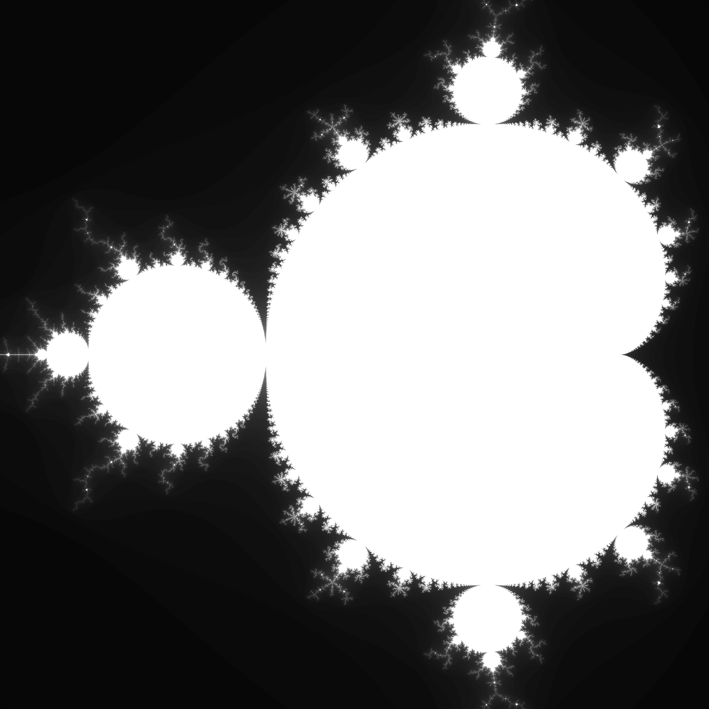

# wasm-mandelbrot
A wasm experiment, drawing the mandelbrot set using Go.

We use the "syscall/js" package to communicate from wasm to js in the browser. 

One can compile the wasm module (from `cmd/wasm/main.go`) by typing :

`` $GOARCH=wasm && $GOOS=js && go build -o main.wasm ``

Then move `main.wasm` in the root directory.
An http server is necessary in order to avoid CORS (Cross-origin resource sharing) limitation from most web browsers.

## Result

## TODOs
- [ ] Add interactivity (button/sliders)
- [ ] Better color function
